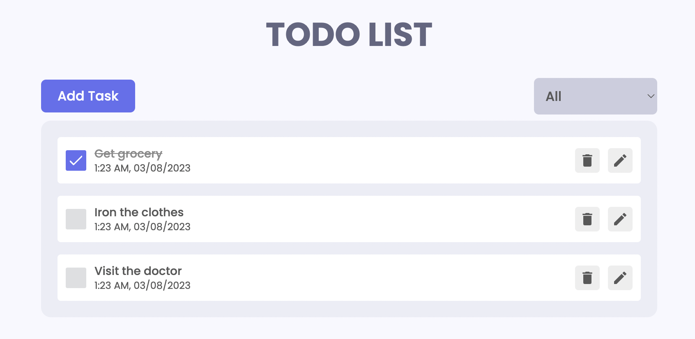
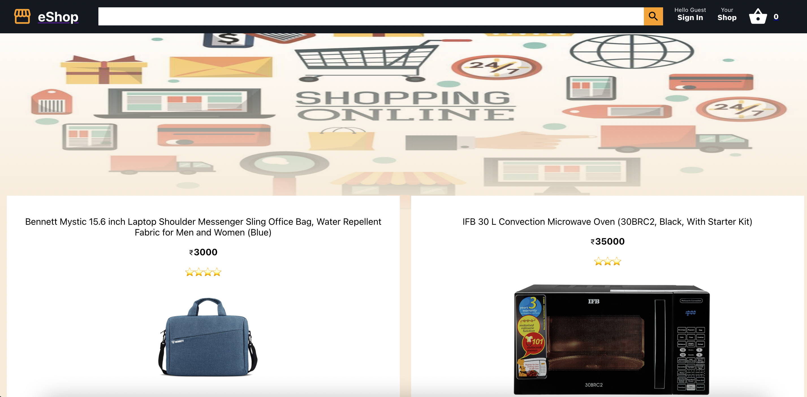
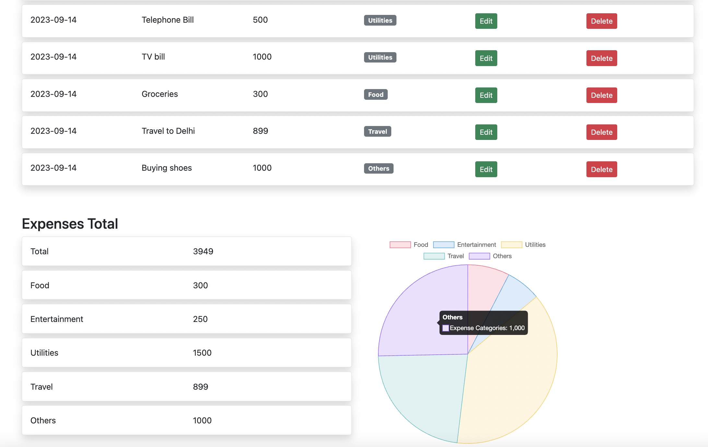

# 👨🏽‍💼 Overview

## Summary

A hands on tech manager with over 12 years of solid work experience in software engineering, automation, developing frameworks and technical leadership.Passionate about building stuff,improving productivity and helping deliver high quality products.

# 👨‍💻 Experience

**Sr. Engineering Manager** @ [Zinnia](https://zinnia.com/) _(Apr 2024 - Present)_

- First hire in the India marketplace team & built two backend teams from scratch
- Contributing to both the strategic vision of the company and tactical execution of projects.
- Led teams of nearly 15 members including a manager,full time employees and contractors.
- Creating system designs & architecture for decoupling of our monolith into microservices.
- Leading the platform team in India for developer experience and authentication.
- Devised and implemented the hiring strategy including sourcing, interviewing and negotiating for SDE3/Sr/ Staff Software engineers in the team.
- PR reviews,creating RFCs & leading the discussions with cross-team stakeholders.

**Engineering Manager** @ [Cofactory.ai](https://www.linkedin.com/company/phia-co/) _(Oct 2023 - Feb 2024(Contractual))_

- Managing a team of frontend, backend, test & data engineers building an AI based scalable product for providing resale of high-end fashion items.
- We developed the extensions for chrome & safari ,a flask powered backend for APIs and a gpt powered image matching service which searches the available catalog of millions of images (from our retailer partners) and provides results in a few seconds.
- End to end ownership of the data pipeline for collecting, cleaning and ingesting retailer data into our vector database.Optimized the BigQuery calls to reduce overall costs.
- Automated the data pipeline using cronjobs and cloud functions on GCP.It helped bring down the data update time in our pipeline from few days to a few hours.

**Engineering Manager** @ [PepperContent](https://www.peppercontent.io/) _(July 2022 - July 2023)_

- Managed the quality & tools team at Pepper with 6 direct reports.Collaborated with product managers, architects and other stakeholders to drive development, testing and delivery of various projects.Helped launch a new SaaS product - [Content Marketing Platform(CMP)](https://www.peppercontent.io/blog/welcome-pepper-cmp/) from scratch.Had other successful launches like [SEO Content](https://www.peppercontent.io/features/keyword-strategy-and-research/), [Pepper docs](https://peppercontent.freshdesk.com/support/solutions/articles/67000696628-docs-by-pepper-your-new-home-for-writing) and several enhancements to our marketplace platform.

- 
Performed the responsibilities of an EM in leading stand-ups, grooming calls and unblocking teams to ensure timely execution. Worked closely with Customer Success teams (to resolve customer issues and understand user feedback) and Marketing(to give them a KT of latest features).

- 
Conducted monthly 1 on 1s, developed employee growth plans, reviewed test cases/pull requests(PR), set up the roadmap of the team and did performance appraisals.

- Hands on with developing automation tests for API testing.
  &nbsp;

**Engineering Lead(SDET)** @ [PayU](https://payu.in/) _(April 2021 - July 2022)_

- Worked on the [Lazypay app](https://www.lazypay.in/) and led the Transactional Credit(TC) business for the company.Managed 3 engineers and responsibilities involved planning, allocating and execution of projects.
- Work closely with product/development teams to estimate the test effort and develop release schedules.
- Expertise in Agile, BDD development, SDLC/STLC , gap analysis and implementing best practices.
- Involved in recruiting,mentoring and developing a team of highly talented engineers.
  &nbsp;

**Senior SDET** @ [PayU](https://payu.in/) _(Feb 2019 - March 2021)_

- 
Designed and implemented a framework completely inhouse to automate the user generation process optimizing for various lending parameters.Incorporated object oriented principles and made it modular such that it is easy to reuse and extend.

- This covered 60% sanity coverage and reduced the manual testing effort by almost 70%.
- 
Integrated it with jenkins to provide continuos testing and ability to the entire organisation(devs/PMs/finOps) to use it without diving into the code themselves.

- Integrated test suite with JIRA for automatic bug filing and triage.
- Developed selenium tests to help automate sanity checklists for the web based coverage.
- Complete ownership of the payments engine for testing. Single point of contact involved in debugging, verification and signing off on releases.
- Led another project to implement mock data(eg PAN/Aadhar) to remove bottleneck for manual QAs in user flow testing.
- Mentored junior engineers, helped introduce new processes (like release planning) and communication across various stake holders.
- Worked cross-team with our lending partners,finance team and developers to ensure timely shipping of products.

**SDET II** @ [Amazon](https://www.amazon.in/) _(Sep 2017 - Jan 2019)_

- Worked on the [Amazon Music app](https://apps.apple.com/us/app/amazon-music-songs-podcasts/id510855668) and led iOS automation team driving bi-weekly sprints and code reviews.Our automation provided 85% additional coverage(via localisation) and saved 60% manual effort.
- 
Involved in the road map from research , test planning, framework implementation to writing test cases. Helped launch streaming service for our product which currently has a user base of nearly 10 million.

- Mentored junior engineers, did task prioritization and helped in hiring & growing the team.
- 
Led team meetings and worked closely across teams for planning,resource gathering and design implementations. This helped guide product development and management decisions.

- 
Established and improved development practices in order to increase team productivity including wiki documentation , bug triage sessions and device lab management.

**Automation Engineer** @ [Apple](https://www.apple.com/) _(Nov 2014 - Sep 2017)_

- Led the development of analytics, UI testing and validation suites (BDD) for [Apple News](https://www.apple.com/apple-news/).
- Worked with product managers to design and test on key initiatives related to increased KPI(eg-ad campaigns)
- 
Built initial prototype of framework which allowed us to quickly verify analytics. My responsibilities included analyzing results, fixing framework issues,measuring analytics and reporting product bugs.

- 
Developed scripts for reporting performance metrics.Compiled performance data for analysis and assisted product managers in development of monthly key results reports.This helped us drive user engagement.

- Worked closely with developer and PM teams in deciding which analytic events to add/remove and how to present them.

**Software Engineer** @ [Nvidia](https://www.nvidia.com/en-us/) _(July 2011 - Oct 2014)_

- Development,debugging and maintenance of the graphics driver for Mac.
- Collaborated with multiple teams to help integrate tests with an internal harness to leverage automation and increase efficiency.

# 👨‍🎓 Education

`2009-2011` [University of Illinois Urbana Champaign](https://illinois.edu/)

- **M.S** in Computer Science
- GPA: 4.0/4.0

`2005-2009` [Birla Institute of Technology and Science](https://www.bits-pilani.ac.in/)

- **B.E.Hons** in Computer Science
- GPA: 9.7/10.0

## 💻 Skills

## General Tech Stacks

- Framework development
- MERN stack
- Django,Flask
- Ruby on Rails

## Programming languages

- Python
- JavaScript
- Go
- React.js
- Java

## Databases

- MySQL
- MongoDB

## Frameworks

- PyTest
- Selenium
- TestNG
- Cucumber

## Vcs

- Git

## Others

- HTML,Css

# 🛠️ Projects

[To-do app](https://rajeshbhasin-todo.netlify.app/) - A simple todo app built with ReactJS to add,edit,filter list of to-dos.

[Stock app](https://rajeshbhasin-stock.netlify.app/) - A simple stock app built with ReactJS to show stock data, a graph of 15-day prices, news related to the stock using Yahoo finance API.

[Eshop app](https://rajeshbhasin-eshop.netlify.app/)- A simple e-commerce app built with ReactJS and firebase.It has basic functionality like displaying products, adding/removing from cart and sign in.

[Expense app](http://rajeshbhasin.pythonanywhere.com/)-An app built with Flask, bootstrap and ChartJS to add/edit and view expenses

# 📖 Publications

- Rajesh Bhasin, Won Jun Jang & John C. Hart-[A parallel stereo reconstruction algorithm with applications in entomology (APSRA)](https://doi.org/10.1117/12.905545) ( 3D Image Processing(3DIP) and Applications 2012)
- Wheatley D, Douros K & Bhasin R. (2010) Concept Usability Evaluation of TuVistaPS Proof of Concept Prototype Motorola ARC Internal Report. 28 Sept 2010.
- Rajesh Bhasin,Abhishek Kumar -[Provis: An Anaglyph Based Visualization Tool for Protein Molecules](https://link.springer.com/chapter/10.1007/978-81-8489-203-1_13) .Proceedings of the International Conference on Intelligent Human Computer Interaction (IHCI 2009 at IIIT Allahabad ,India).
