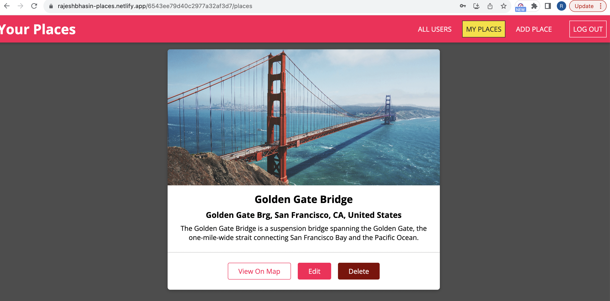
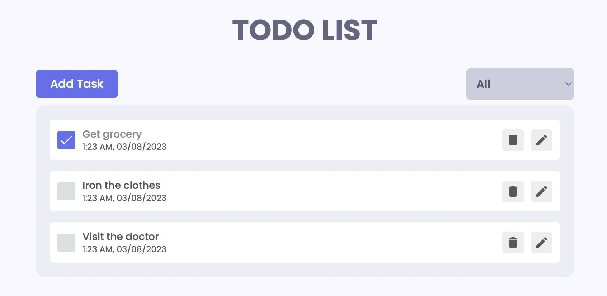
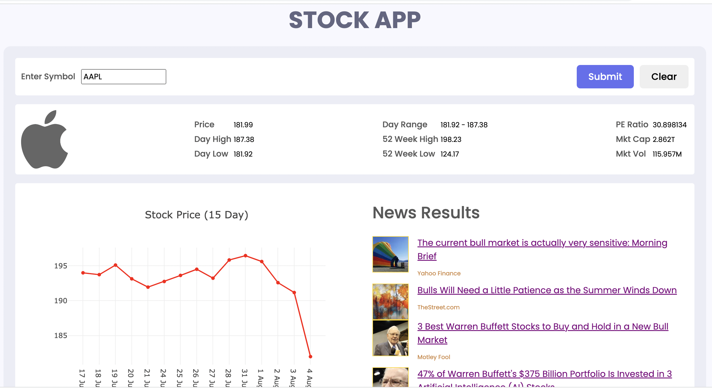
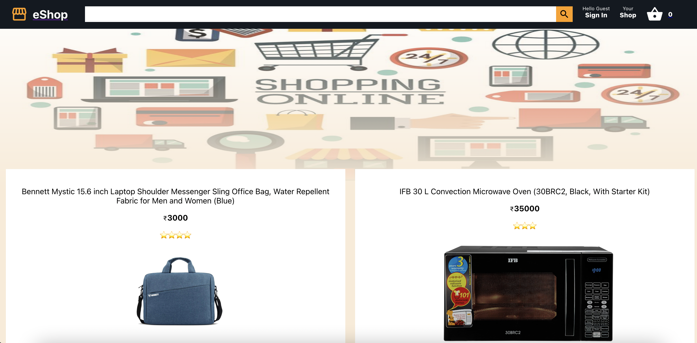
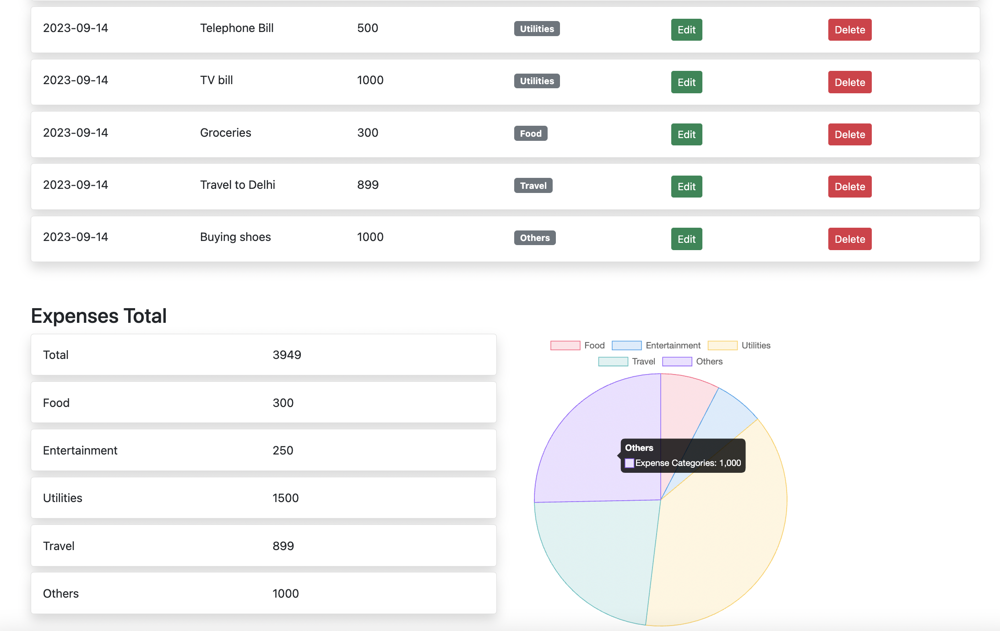

# 🛠️ Projects

[Places app](https://rajeshbhasin-places.netlify.app/) - A MERN stack app which has user authorization, user authentication and lets a user add places and images associated with them.Only the places created by the user can be edited or deleted.Additionally the user can add profile picture during signup.

[To-do app](https://rajeshbhasin-todo.netlify.app/) - A simple todo app built with ReactJS to add,edit,filter list of to-dos.

[Stock app](https://rajeshbhasin-stock.netlify.app/) - A simple stock app built with ReactJS to show stock data, a graph of 15-day prices, news related to the stock using Yahoo finance API.

[Eshop app](https://rajeshbhasin-eshop.netlify.app/)- A simple e-commerce app built with ReactJS and firebase.It has basic functionality like displaying products, adding/removing from cart and sign in.

[Expense app](http://rajeshbhasin.pythonanywhere.com/)-An app built with Flask, bootstrap and ChartJS to add/edit and view expenses

